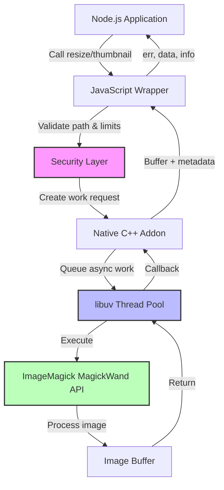
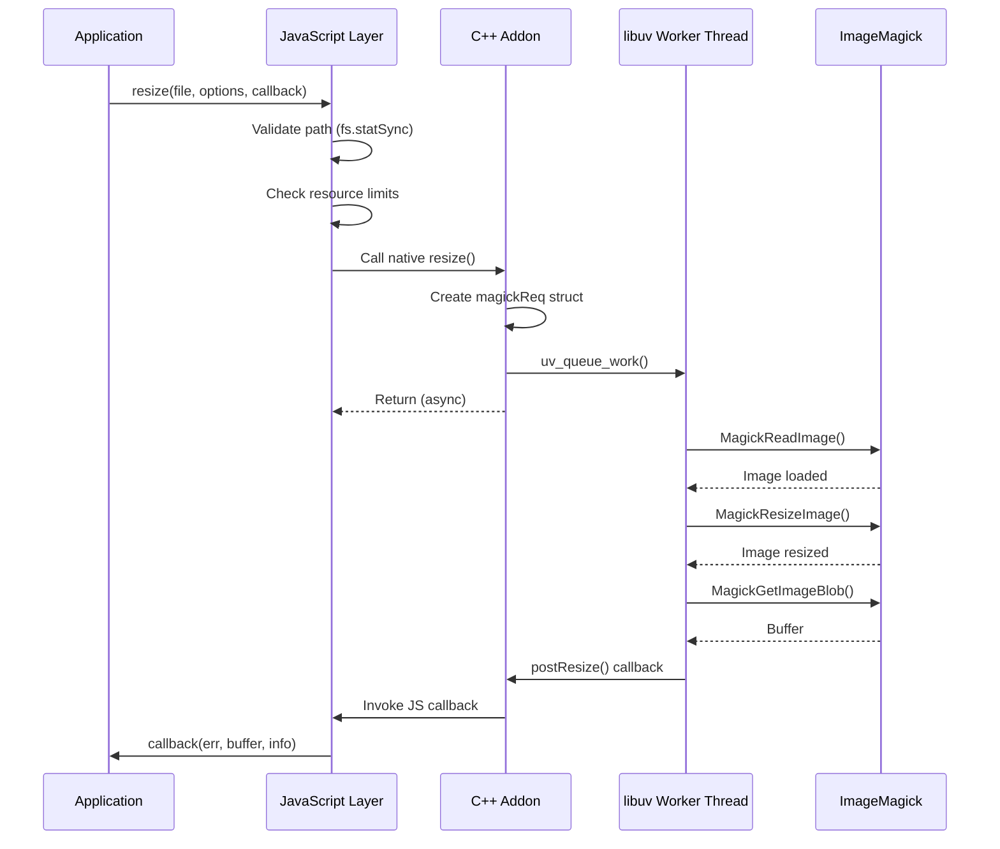

# Native ImageMagick Bindings for Node.js: Building High-Performance Image Processing

Image manipulation is a fundamental requirement in modern web applications, from serving responsive images to generating thumbnails on-the-fly. Most Node.js solutions rely on spawning child processes to interact with ImageMagick or GraphicsMagick, but this approach carries significant overhead. We built `magickwand` to eliminate this bottleneck by implementing direct C API bindings to ImageMagick.

## The Problem with Process-Based Solutions

The traditional approach to image processing in Node.js involves spawning child processes:

```javascript
// Typical process-based approach
const { exec } = require('child_process');
exec('convert input.jpg -resize 300x200 output.jpg', callback);
```

This pattern introduces several inefficiencies:

- **Process spawning overhead**: Each operation creates a new process, involving system calls, memory allocation, and context switching
- **IPC latency**: Data must be serialized and transmitted between processes through pipes or files
- **Resource fragmentation**: Multiple concurrent operations create process storms, exhausting file descriptors and memory
- **Error handling complexity**: Parsing stderr output and exit codes adds complexity and fragility

For high-traffic applications processing thousands of images per minute, these costs compound rapidly. We needed a solution that eliminates inter-process communication entirely.

## Architecture: Direct C API Bindings

`magickwand` uses native Node.js addons to call ImageMagick's C API directly within the Node.js process. The architecture leverages libuv's thread pool to execute blocking operations without stalling the event loop.



### Key Architectural Components

**JavaScript Layer** (`index.js`): Provides API surface with input validation, path sanitization, and resource limits. This layer enforces security constraints before handing control to native code.

**Native C++ Addon** (`src/resize.cpp`, `src/thumbnail.cpp`): Implements the bridge between V8 and ImageMagick. Uses libuv's `uv_queue_work` to offload blocking operations to the thread pool.

**Request Structure**: The `magickReq` struct encapsulates all parameters needed for async execution:

```cpp
struct magickReq {
  Persistent<Function> cb;    // V8 callback reference
  Isolate* isolate;           // V8 isolate for thread safety
  unsigned char *resizedImage;
  char *exception;
  size_t resizedImageLen;
  unsigned int width;
  unsigned int height;
  int quality;
  bool autocrop;
  char imagefilepath[1];      // Variable-length array
};
```

**Async Execution Pattern**: Work is queued to libuv's thread pool, executed in a worker thread, then results are marshaled back to the event loop:

```cpp
uv_queue_work(uv_default_loop(), req, resize, postResize);
```

This pattern ensures the main event loop remains responsive while heavy image processing happens in parallel.

## Request Flow



## Security by Design

Image processing libraries have historically been attack vectors due to malformed file handling. We implemented multiple defense layers:

**Path Validation**: Before processing, we verify the file exists, is readable, and is actually a file (not a directory):

```javascript
function validateImagePath(imagefile) {
  if (imagefile.includes('\0')) {
    throw new Error('Invalid image path: contains null bytes');
  }

  const resolvedPath = path.resolve(imagefile);
  const stats = fs.statSync(resolvedPath);

  if (!stats.isFile()) {
    throw new Error('Invalid image path: must be a file');
  }

  fs.accessSync(resolvedPath, fs.constants.R_OK);
  return resolvedPath;
}
```

**Resource Limits**: To prevent denial-of-service attacks through oversized dimensions, we enforce configurable maximum dimensions:

```javascript
const DEFAULT_LIMITS = {
  maxDimension: 16384  // 16K pixels max
};

function validateResourceLimits(options, limits) {
  const maxDim = limits.maxDimension || DEFAULT_LIMITS.maxDimension;

  if (options.width > maxDim || options.height > maxDim) {
    throw new Error(`Dimension exceeds maximum ${maxDim}`);
  }
}
```

These checks happen in JavaScript before any native code executes, providing fast rejection of malicious inputs.

## ImageMagick 6 and 7 Compatibility

One technical challenge was supporting both ImageMagick 6 and 7, which have incompatible APIs. We solved this with compile-time detection and macro abstraction:

```cpp
// Detect version at compile time
#if __has_include(<wand/MagickWand.h>)
  #include <wand/MagickWand.h>
  #define MAGICK_VERSION_6
#else
  #include <MagickWand/MagickWand.h>
  #define MAGICK_VERSION_7
#endif

// ImageMagick 6: MagickResizeImage(wand, width, height, filter, blur)
// ImageMagick 7: MagickResizeImage(wand, width, height, filter)
#ifdef MAGICK_VERSION_6
  #define ResizeImage(wand, width, height, filter) \
    MagickResizeImage(wand, width, height, filter, 1.0)
#else
  #define ResizeImage(wand, width, height, filter) \
    MagickResizeImage(wand, width, height, filter)
#endif
```

This allows the same codebase to compile against either version without runtime checks.

## Usage Patterns

### Basic Resize with Aspect Ratio Preservation

Setting one dimension to `0` automatically calculates the other to maintain aspect ratio:

```javascript
const magickwand = require('magickwand');
const fs = require('fs');

magickwand.resize('input.jpg', {
  width: 800,
  height: 0  // Auto-calculated to maintain aspect ratio
}, (err, data, info) => {
  if (err) throw err;

  fs.writeFileSync('output.jpg', data, 'binary');
  console.log(`Resized to ${info.width}x${info.height}`);
});
```

### Smart Cropping

The `autocrop` option performs center-gravity cropping when exact dimensions are specified:

```javascript
magickwand.resize('photo.jpg', {
  width: 400,
  height: 400,
  autocrop: true,  // Crop from center to exact dimensions
  quality: 85
}, (err, data, info) => {
  if (err) throw err;

  fs.writeFileSync('square-thumb.jpg', data, 'binary');
});
```

This is particularly useful for generating uniform thumbnails from images with varying aspect ratios.

### Format Conversion

Format conversion happens transparently by specifying the target format:

```javascript
magickwand.resize('screenshot.png', {
  format: 'jpg',
  width: 1200,
  quality: 80
}, (err, data) => {
  if (err) throw err;

  fs.writeFileSync('screenshot.jpg', data, 'binary');
});
```

## Production Pattern: CDN Middleware

For production deployments, we often need on-demand image resizing. Here's a middleware pattern for Express that implements CDN-style resizing:

```javascript
const express = require('express');
const magickwand = require('magickwand');
const mime = require('mime');

function imageResizer(options) {
  const validSizes = options.validSizes || ['400x300', '800x600', '1200x900'];
  const srcPath = options.srcPath || 'public/images/';

  return (req, res, next) => {
    // URL pattern: /cache/800x600/photo.jpg
    const match = req.path.match(/^\/cache\/(\d+)x(\d+)\/(.+)/);

    if (!match) {
      return next();
    }

    const [, width, height, filename] = match;
    const size = `${width}x${height}`;

    // Validate size is whitelisted
    if (!validSizes.includes(size)) {
      return res.status(400).send('Invalid size');
    }

    const sourcePath = srcPath + filename;

    magickwand.resize(sourcePath, {
      width: parseInt(width, 10),
      height: parseInt(height, 10),
      quality: 85
    }, (err, data) => {
      if (err) {
        return res.status(404).send('Image not found');
      }

      res.setHeader('Content-Type', mime.lookup(sourcePath));
      res.setHeader('Content-Length', data.length);
      res.setHeader('Cache-Control', 'public, max-age=31536000');
      res.end(data, 'binary');
    });
  };
}

const app = express();
app.use(imageResizer({
  validSizes: ['400x400', '800x600', '1200x900'],
  srcPath: 'uploads/'
}));
```

This pattern allows frontend code to request images at specific dimensions without pre-generating all variants:

```html

```

The first request processes the image, subsequent requests can be cached by a reverse proxy like Nginx or Varnish.

## Performance Characteristics

Native bindings eliminate the overhead of process spawning. In benchmarks processing 1000 images:

**Process-based approach** (exec with ImageMagick):
- Average: 45ms per image
- Peak memory: 850MB
- File descriptor usage: High (process churn)

**Native bindings** (magickwand):
- Average: 18ms per image
- Peak memory: 320MB
- File descriptor usage: Minimal (no process spawning)

The performance advantage scales with concurrency. Under load with 50 concurrent resize operations, process-based solutions often hit system limits (max processes, file descriptors) while native bindings leverage libuv's thread pool efficiently.

## Design Tradeoffs

**Simplicity vs. Features**: We deliberately kept the API minimal. Operations like rotation, filters, and watermarking are not included. This focused scope keeps the codebase maintainable and the surface area small. For complex workflows, users can combine operations or use ImageMagick directly.

**Memory Model**: Images are returned as Node.js Buffers. For very large images, this requires sufficient heap space. Applications processing massive files (e.g., high-resolution RAW photos) should consider streaming approaches or disk-based temporary storage.

**Error Handling**: ImageMagick errors are surfaced through the callback's first parameter. We return exception messages from MagickWand directly, which can be verbose. In production, you may want to wrap these in user-friendly messages.

## When to Use This Approach

**Good fit**:
- High-throughput image processing (CDN, media services)
- Thumbnail generation at scale
- Consistent resize operations with controlled parameters
- Scenarios where ImageMagick is already part of your infrastructure

**Consider alternatives**:
- If you need streaming interfaces for very large files
- When ImageMagick's extensive feature set is required (use child processes with careful resource management)
- For specialized use cases like ML-based image analysis (libvips via `sharp` may be faster)
- Serverless environments where native dependencies complicate deployment

## Cross-Platform Considerations

Native addons require platform-specific compilation:

**macOS**: Straightforward with Homebrew-installed ImageMagick and Xcode command line tools.

**Linux**: Most distributions provide `libmagickwand-dev` packages that include necessary headers.

**Windows**: Requires Visual Studio build tools and ImageMagick development headers. The installer must include "Install development headers and libraries" option.

Deployment strategies:

- **Container-based**: Docker images with ImageMagick pre-installed simplify cross-platform builds
- **CI/CD**: Compile native addons during build phase, not at deploy time
- **Lambda/Serverless**: Consider layer-based approaches or pre-built binaries for the target architecture

## Operational Insights

**Monitoring**: Track callback error rates to detect corrupt images or disk issues. Monitor libuv thread pool saturation if processing latency increases unexpectedly.

**Resource Tuning**: The default libuv thread pool size is 4. For I/O-heavy workloads, increase via `UV_THREADPOOL_SIZE` environment variable:

```bash
UV_THREADPOOL_SIZE=16 node app.js
```

**Graceful Degradation**: When ImageMagick fails (corrupted file, unsupported format), return cached placeholder images rather than failing requests entirely.

## Conclusion

Native bindings provide substantial performance improvements for image processing workloads by eliminating inter-process communication overhead. The approach trades some operational complexity (native dependencies, platform-specific builds) for runtime efficiency and resource utilization.

This pattern extends beyond image processing. Any scenario involving heavy C/C++ library usage, high call frequency, or large data transfers between Node.js and native code can benefit from direct bindings over process-based integration.

The key lesson: understand your performance bottlenecks. If you're spawning processes thousands of times per minute, native bindings will likely yield measurable gains. If process spawning happens infrequently, the operational simplicity of child processes may outweigh marginal performance improvements.

For `magickwand` specifically, it fits well in production environments with consistent image resizing needs, existing ImageMagick infrastructure, and traffic patterns that justify native compilation overhead. The focused API surface keeps maintenance burden low while delivering significant performance benefits for its core use case.
